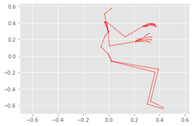
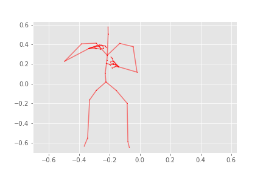
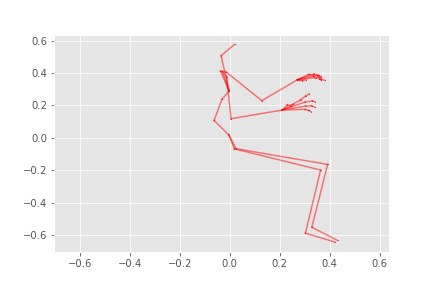

# gaitplotlib
> Lightweight way to map from SMPL/SMPL-H parameters to plottable coordinates/meshes in 3D space


This library is supposed to make it easier to convert from SMPL-H/SMPL parameters, which have become the de facto pose representation in the literature, into points and meshes that can be plotted in different visualisation packages.

## To Do

1. Add note about installing pytorch first
2. Example plotting a gif here using code from core
3. Write documentation here describing what this is for

## Install

Requirements:

- [PyTorch][]
- [human_body_prior][hbp] (I fixed version the required version at `7f0a4b3`)
- [chumpy][] (the only reason this has to be installed is because the SMPL/SMPL-H model pickle files contain chumpy array objects, these are turned into numpy arrays in my unpacking script)
- [mediapy][] for loading, manipulating and rendering videos/animations
- [matplotlib][] although the points and meshes could be plotted in other frameworks
- [smplx][] (only to provide annotations for the SMPL-H joint names)

[matplotlib]: https://matplotlib.org/
[mediapy]: https://github.com/google/mediapy
[chumpy]: https://github.com/mattloper/chumpy
[hbp]: https://github.com/nghorbani/human_body_prior
[pytorch]: https://pytorch.org/
[smplx]: https://github.com/vchoutas/smplx

Install with pip from github:

`pip install git+https://github.com/gngdb/gaitplotlib.git`

## How to use

### Download Body Models

First, obtain body model archives from MPI, either: [SMPL][] or [SMPL-H][mano]. Make an account and download the archives.

[smpl]: https://smpl.is.tue.mpg.de/
[mano]: https://mano.is.tue.mpg.de/

### Unpack Body Models

A console script is provided to unpack the body models:

```
unpack_body_models <directory containing archives> <smpl/smplh>
```

This will unpack the body model archives and put them in the format matching what [SMPL-X][smplx] expects (because I originally planned to use that code).

[smplx]: https://github.com/vchoutas/smplx

### Make pose angles plottable

SMPL* pose data is defined by a vector of pose angles. Assuming you have such a vector, you can map it to a plottable form

```
> params = plottable(data['poses'])
> print(params)
vertices:torch.Size([601, 6890, 3])joints: torch.Size([601, 52, 3])
faces: torch.Size([13776, 3])
skeleton: torch.Size([51, 2])
```

`params` is an object storing `vertices`, `joints`, `faces` and `skeleton` as properties and it has a `__getitem__` method to index poses in the sequence, which are output as dictionaries:

```
> print({k:v.shape for k,v in params[0].items()}){'vertices': torch.Size([6890, 3]), 'joints': torch.Size([52, 3]), 'faces': torch.Size([13776, 3]), 'skeleton': torch.Size([51, 2])}
```

### Matplotlib Example

```
import matplotlib.pyplot as plt
plt.style.use('ggplot')

for d in range(3):
    dims_to_plot = [i for i in range(3) if i != d]
    joints, skeleton = params[0]['joints'], params.skeleton
    j = joints[:,dims_to_plot]
    plt.scatter(*j.T, color='r', s=0.2)
    # dim limits must match or figure will be distorted
    xl, yl = plt.xlim(), plt.ylim()
    l = (min(xl[0], yl[0]), max(xl[1], yl[1]))
    plt.xlim(*l)
    plt.ylim(*l)
    for bone in skeleton:
        a = j[bone[0]]
        b = j[bone[1]]
        x, y = list(zip(a, b))
        plt.plot(x, y, color='r', alpha=0.5)
    plotted_dims = ''.join(['x', 'y', 'z'][i] for i in dims_to_plot)
    plt.savefig(f'images/example_2d_{plotted_dims}.png')
    plt.show()
```

    images/example_2d_xy.png





    images/example_2d_yz.png





    images/example_2d_xz.png




